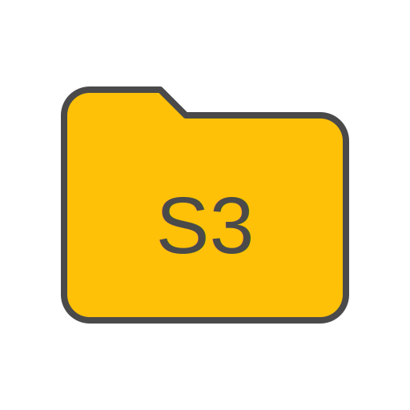
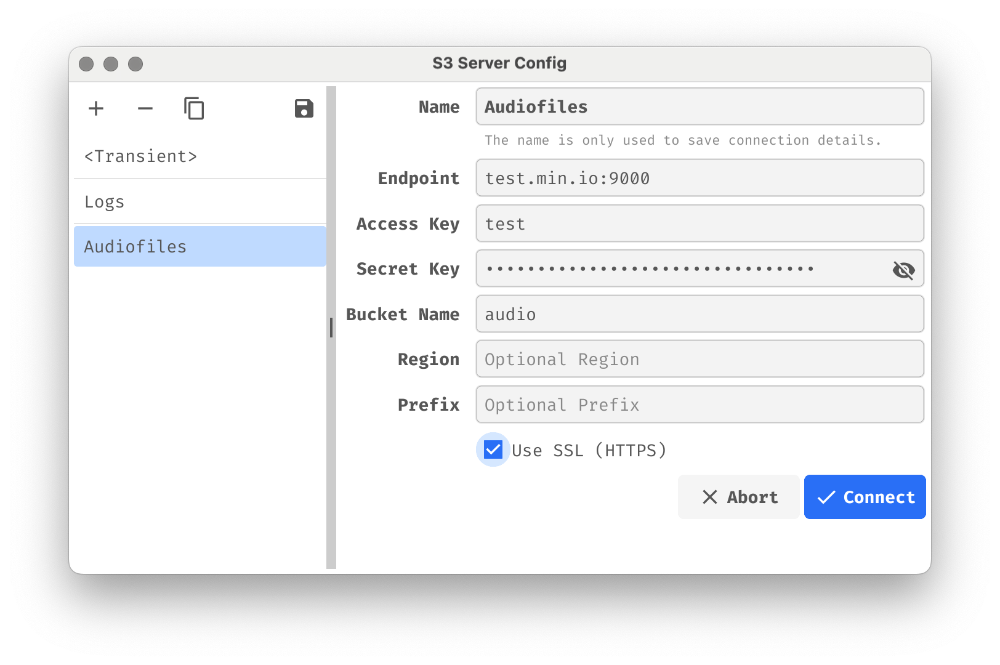
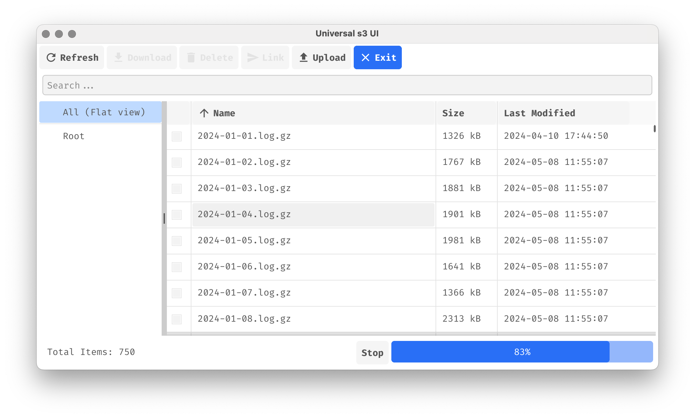
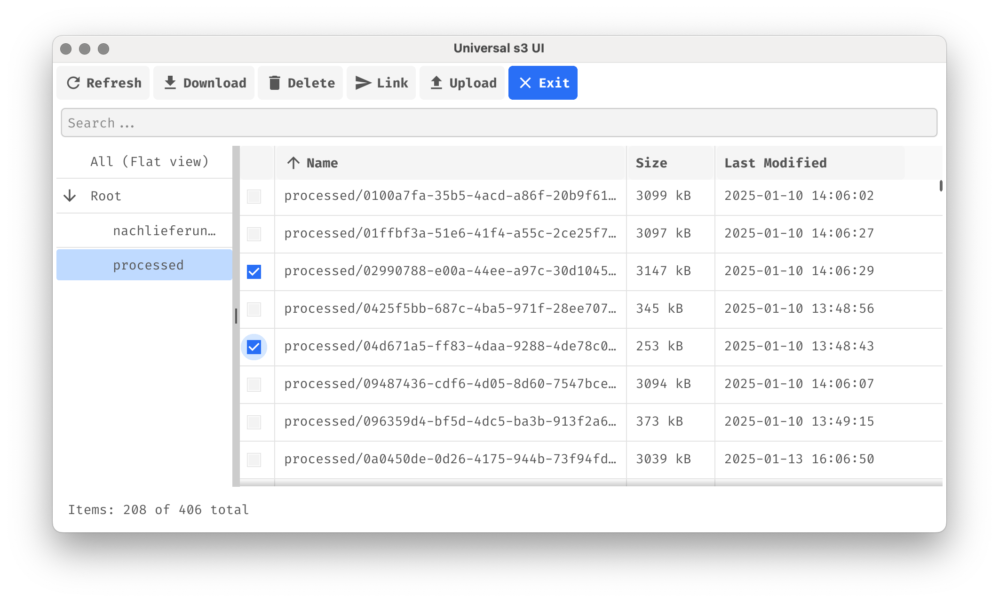

# Universal S3 UI (us3ui) 


Universal S3 UI is a lightweight, cross-platform graphical user interface for managing S3-compatible object storage services, with a particular focus on non-AWS implementations.
Built with Go and Fyne, this application provides a seamless experience across macOS, Windows, and Linux and is provided as a native app.
[https://us3ui.pteich.de](https://us3ui.pteich.de)

## Features

- **Universal Compatibility**: Works with any S3-compatible storage service (Minio, Ceph, etc.)
- **Connection Manager**: Save and manage multiple S3 service configurations
- **Drag-and-Drop Support**: Drag multiple files from your local machine to upload to your bucket
- **Secure Connections**: Support for both HTTP and HTTPS connections
- **File Management**:
  - Browse objects in your bucket with size information
  - Upload local files to your bucket
  - Download selected files from your bucket to your local machine
  - Delete objects
  - Select files and generate temporary download links valid for one hour
  - Refresh bucket contents
- **Asynchronous Loading**: Load objects without blocking the UI
- **Search Functionality**: Easily find objects with simple fulltext search
- **Progress Tracking**: Visual progress bar for long-running operations
- **Pagination**: Load objects in batches for improved performance
- **Detailed Object Information**: View object name, size, and last modified date
- **Responsive UI**: Resizable columns for better visibility of object details

## Planned Features

- _Sorting_: Sort objects by name, size, or last modified date

## ❤️ Sponsoring

If you find Universal S3 UI helpful, please consider supporting its development through GitHub Sponsors. Your support helps maintain and improve this project!

[](https://github.com/sponsors/pteich)

## Download Pre-built Binaries

You can download pre-built binaries for Linux, macOS, and Windows from the [GitHub Releases](https://github.com/pteich/us3ui/releases) page. This allows you to quickly get started with Universal S3 UI without needing to build from source. Simply download the appropriate binary for your operating system, extract it, and run the executable.

## Running on macOS and Windows (Unsigned builds)

The pre-built binaries are currently not code-signed. macOS Gatekeeper and Windows Defender SmartScreen may warn or block the first launch. This is expected for unsigned apps. You can still run the app by following the steps below.

### macOS

1. Download the macOS ZIP from the Releases page and unzip it.
2. Optional: Move "Universal s3 GUI.app" to your Applications folder.
3. First launch via Finder:
   - Right-click (or Ctrl-click) the app and choose "Open".
   - When the warning dialog appears, click "Open". This is only needed once per download.
4. If you already tried to open it by double-click and it was blocked:
   - Open System Settings → Privacy & Security.
   - In the Security section, find the message that the app was blocked and click "Open Anyway", then confirm with "Open".
5. Advanced (optional): Remove the download quarantine in Terminal if Finder keeps blocking it:
   
```bash
   xattr -dr com.apple.quarantine "/Applications/Universal s3 GUI.app"
```

   Adjust the path if you keep the app outside Applications.

### Windows

1. Download the Windows ZIP, right-click it → Properties → if you see an "Unblock" checkbox on the General tab, check it and click Apply, then extract.
2. Start the app by double-clicking the EXE. If you see "Windows protected your PC":
   - Click "More info".
   - Verify the app name, then click "Run anyway".
3. If Windows still blocks it, right-click the extracted EXE → Properties → check "Unblock" (if present), then Apply and try again.


## Getting Started

### Prerequisites

- Any S3-compatible storage service credentials
- For building from source: Go programming language

### Configuration

When you start the application, you can use the GUI to manage your connections:

1. Create a new connection by providing:

   - **Name**: A unique name for your connection
   - **Endpoint**: Your S3 service endpoint (e.g., "play.min.io")
   - **Access Key**: Your S3 access key
   - **Secret Key**: Your S3 secret key
   - **Bucket Name**: The name of the bucket you want to access
   - **Prefix**: (Optional) A prefix to filter objects in the bucket
   - **Region**: (Optional) The region of your S3 service
   - **SSL**: Toggle for HTTPS connection (recommended for production use)

2. Save the connection, which will be stored in a local configuration file. The location of this file depends on your operating system.

3. You can create and save multiple connections for different S3 services or buckets.

The configuration values can also be preset using CLI flags or environment variables. If provided, these will automatically create a special connection named "<Transient>". The available options are:

- **Endpoint**: `--endpoint` or `ENDPOINT`
- **Access Key**: `--accesskey` or `ACCESS_KEY`
- **Secret Key**: `--secretkey` or `SECRET_KEY`
- **Bucket Name**: `--bucket` or `BUCKET`
- **Prefix**: `--prefix` or `PREFIX`
- **Region**: `--region` or `REGION`
- **SSL**: `--usessl` or `USE_SSL`

### Usage

1. Launch the application
2. Select a saved connection or create a new one
3. Click "Connect" to establish the connection
4. Use the main interface to:
   - View objects in your bucket with detailed information
   - Use the search bar to find specific objects
   - Select one or multiple objects to download or delete files
   - Use upload to add new local files to your bucket
   - Select files and generate temporary download links
   - Click "Exit" to close the application

## Screenshots

Here's a visual walkthrough of the application:

### Login Screen


_The login screen where you enter your S3 service configuration details_

### File List View


_Main interface showing the list of objects in your bucket_

### Select files to download


_Select one or multiple objects by clicking the checkbox in the first column to download or delete_

### Upload Dialog


_File upload interface for adding new objects to your bucket_

## Technical Details

Built using:

- [Fyne](https://fyne.io/) - Cross-platform GUI toolkit for Go
- [MinIO Go Client](https://github.com/minio/minio-go) - S3-compatible storage client

## Security Note

Ensure you're using SSL (HTTPS) when connecting to production servers to protect your credentials and data in transit.
All credentials are only used on your local machine to create the necessary connection.
If you save connections using the connection manager, please notice that the secret key is saved in
your local config file unencrypted. Leave the field empty before saving or don't save connections at all to prevent this.

## License

MIT License
